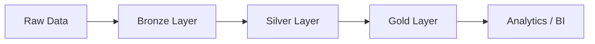

# 🚀 Databricks ETL Pipeline


---

## 🧠 Overview

This project demonstrates a **modern ETL pipeline** built using the **Lakehouse architecture** on the Databricks platform.

The pipeline processes raw data through multiple layers, transforming it into clean, analytics-ready datasets.

---

## 🏗️ Architecture

This project follows the **Medallion Architecture**:

```
Bronze → Silver → Gold
```

* 🥉 **Bronze Layer**: Raw data ingestion (no transformations)
* 🥈 **Silver Layer**: Data cleaning and validation
* 🥇 **Gold Layer**: Aggregated, business-ready data

---

## ⚙️ Tech Stack

* 🔥 Databricks (Lakehouse Platform)
* ⚡ Apache Spark
* 🐍 Python (PySpark)
* 💾 Delta Lake
* ☁️ Cloud Storage (simulated in Free Edition)

---

## 📂 Project Structure

```
📁 databricks-etl-pipeline
│
├── 📁 notebooks
│   ├── bronze_ingestion.py
│   ├── silver_transformation.py
│   └── gold_aggregation.py
│
├── 📁 data
│   ├── raw/
│   ├── processed/
│   └── curated/
│
├── 📁 pipelines
│   └── etl_pipeline.py
│
└── README.md
```

---

## 🔄 Pipeline Flow



---

## 🚀 Getting Started

### 1️⃣ Clone the repository

```bash
git clone https://github.com/your-username/databricks-etl-pipeline.git
```

---

### 2️⃣ Open in Databricks

* Import notebooks into your workspace
* Attach a cluster
* Run each layer step by step

---

### 3️⃣ Execute the pipeline

```python
# Example
run_pipeline()
```

---

## 📊 Example Use Cases

* 📈 Business analytics
* 🤖 Machine learning feature engineering
* 🏦 Financial data pipelines
* 📊 Dashboard data preparation

---

## 🧪 Future Improvements

* ⏳ Add orchestration (Workflows)
* 📡 Streaming ingestion (Auto Loader)
* 🧱 Data quality checks
* 🔐 Data governance

---

## 🤝 Contributing

Contributions are welcome! Feel free to open issues or submit PRs.

---

## 📌 Author

👨‍💻 Developed by **Thomas Hoffmann**

---

## ⭐ Final Thoughts

This project is a hands-on implementation of **modern data engineering principles** using the Databricks ecosystem.

> “Turning raw data into valuable insights, one pipeline at a time.” 🚀
